# Neural Network Architecture - Visual Diagram

## System Topology Overview

## Scroll Journey Flow

## Neural Network Data Flow Animation

## Component Hierarchy

## Z-Depth Layer Visualization

## Animation State Machine

```mermaid
stateDiagram-v2
    [*] --> Dormant: Page Load
    
    Dormant --> Activating: Scroll Into View
    Activating --> Active: Animation Complete
    Active --> Pulsing: Data Transmission
    Pulsing --> Active: Pulse Complete
    Active --> Dormant: Scroll Out of View
    
    state Dormant {
        [*] --> Hidden
        Hidden : opacity: 0.3
        Hidden : scale: 0.7
        Hidden : filter: brightness(0.5)
    }
    
    state Activating {
        [*] --> Growing
        Growing : Spring animation
        Growing : 600ms duration
        Growing : scale 0.7 → 1.0
    }
    
    state Active {
        [*] --> Breathing
        Breathing : Continuous loop
        Breathing : 3s duration
        Breathing : Gentle glow pulse
    }
    
    state Pulsing {
        [*] --> Flash
        Flash : Single pulse
        Flash : 400ms duration
        Flash : scale 1.0 → 1.2 → 1.0
    }
```

## Responsive Layout Evolution

